# AWS-Infrastructure-Automation-with-Ansible

## 📌 Project Overview

This project demonstrates Infrastructure Automation using Ansible across two AWS regions. In Mission 1, a control node was configured in the Mumbai region to manage multiple Linux client nodes using Ansible Playbooks, Roles, and passwordless SSH. The automation project was version-controlled using Git and pushed to GitHub. In Mission 2, the same repository was cloned in the Hyderabad region, where the playbooks were executed again to recreate the infrastructure and deploy the web server without manual configuration. This project highlights Infrastructure as Code (IaC), configuration management, and reusable automation across different environments.


## 🏗️ Architecture Diagram

> **Insert your Architecture Diagram screenshot here (Page 1)**

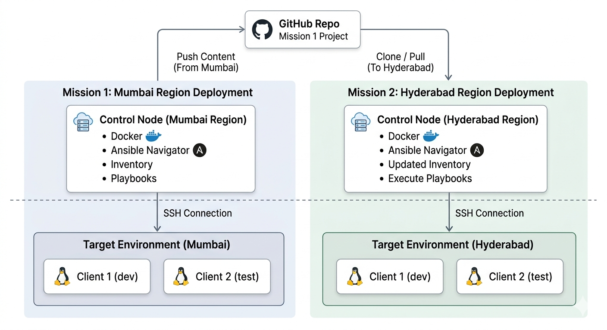


## 🛠️ Technologies Used

- AWS EC2
- Amazon Linux 2023
- Ansible
- Ansible Navigator
- Docker
- Apache HTTP Server
- Git
- GitHub
- SSH
- Linux Administration
- Jinja2 Templates


## ✨ Key Features

- Automated multi-server configuration using Ansible Playbooks
- Passwordless SSH authentication between control and managed nodes
- Inventory-based host management
- Automated package installation
- Apache Web Server deployment using Ansible Roles
- Dynamic web page generation using Jinja2 Templates
- Configuration management using Playbooks
- Git-based version control
- Infrastructure recreation by cloning the Git repository in a different AWS region


## 🔄 Project Workflow

1. Launch AWS EC2 instances
2. Configure passwordless SSH
3. Install Docker and Ansible Navigator
4. Configure Inventory and ansible.cfg
5. Create and execute Ansible Playbooks
6. Deploy Apache Web Server using Roles
7. Verify successful deployment
8. Push automation project to GitHub
9. Clone the repository in another AWS Region
10. Re-execute playbooks to recreate the infrastructure


## 📁 Project Structure

```text
ansible/
├── inventory
├── ansible.cfg
├── packages.yml
├── myrole.yml
├── issue.yml
├── custom.yml
├── roles/
│   └── myrole/
│       ├── tasks/
│       ├── templates/
│       ├── handlers/
│       ├── vars/
│       └── defaults/
└── README.md
```


# 📷 Screenshots

## 1️⃣ AWS Infrastructure

> Launching EC2 Control Node and Client Nodes

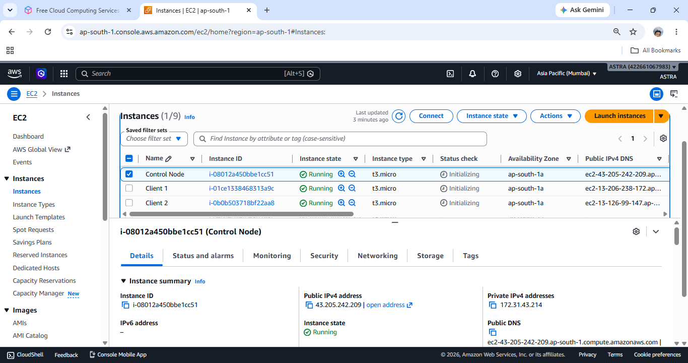


## 2️⃣ SSH Key Authentication

> Passwordless SSH communication between Control Node and Client Nodes

<p align="center">
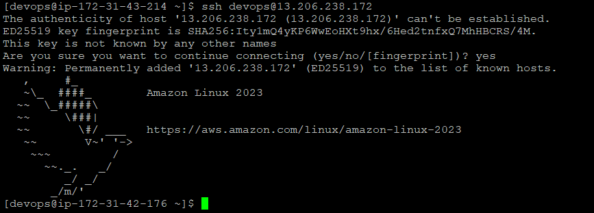
</p>


## 3️⃣ Ansible Inventory Configuration

> Inventory file and ansible.cfg configuration

<p align="center">
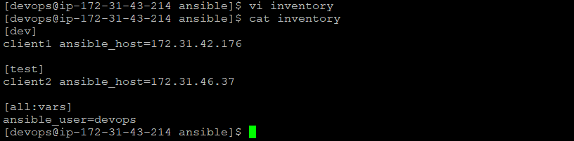
</p>

<p align="center">

</p>


## 4️⃣ Playbook Execution

### Connectivity Verification

Successfully verified connectivity between the control node and all managed nodes.

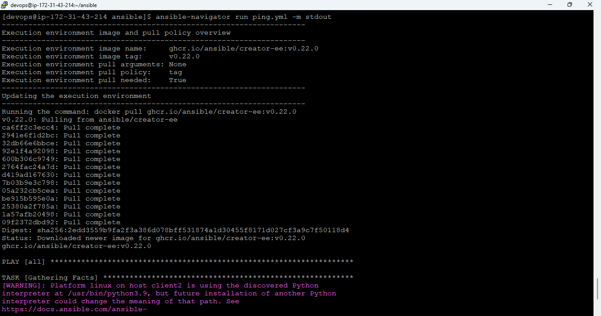
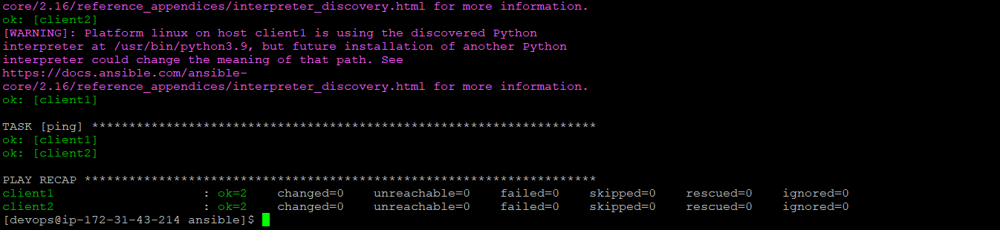

### Package Installation

Installed required software packages automatically.

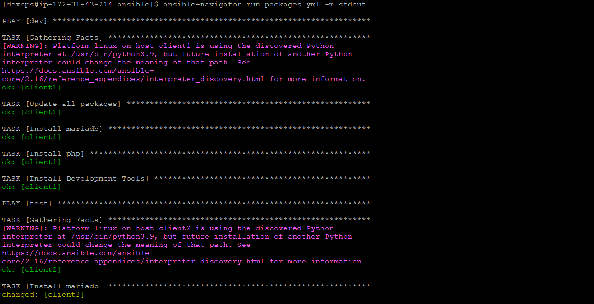
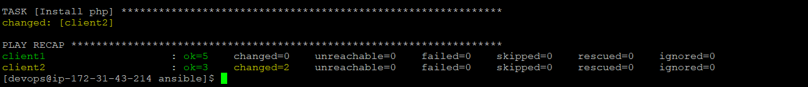

### Apache Deployment Using Roles

Deployed and configured Apache Web Server using reusable Ansible Roles.

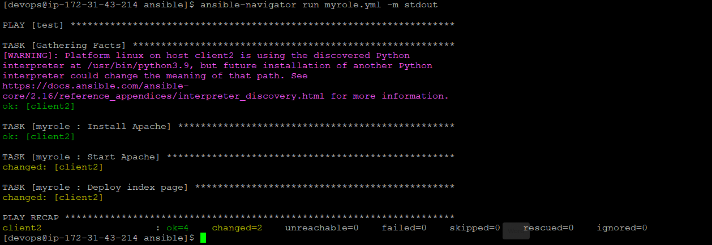

### Issue File Configuration

Configure the custom /etc/issue banner.

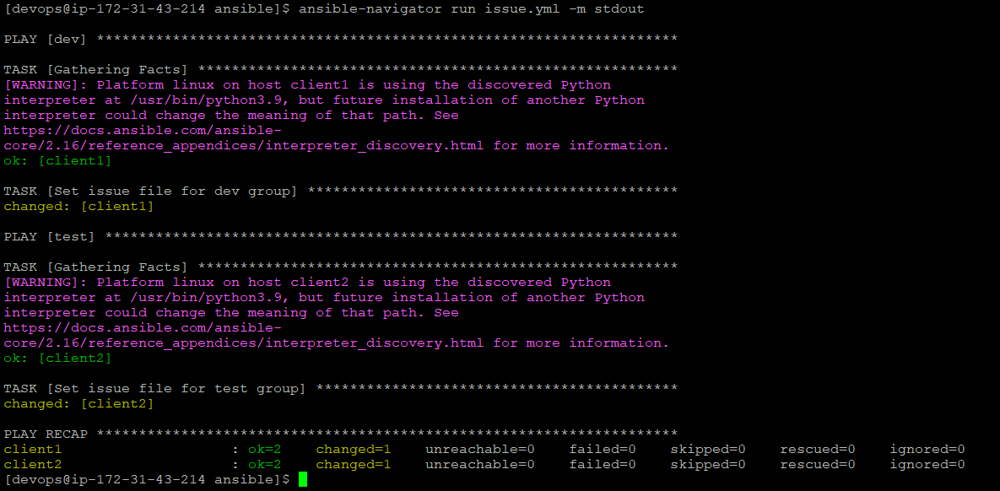

### Custom Web Configuration

Created a custom web directory and deployed the application.

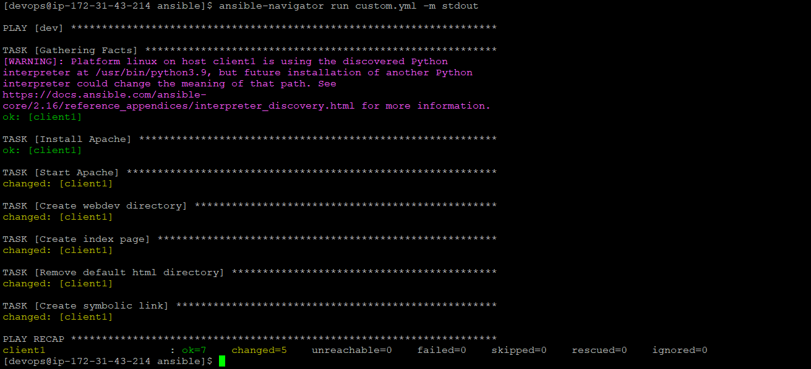


## 5️⃣ Deployment Verification

### Apache Service Status

Verified that the Apache HTTP service is active and running.

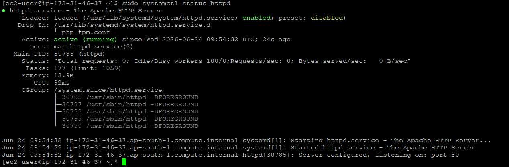


## 5️⃣ GitHub Repository

> Project successfully pushed to GitHub

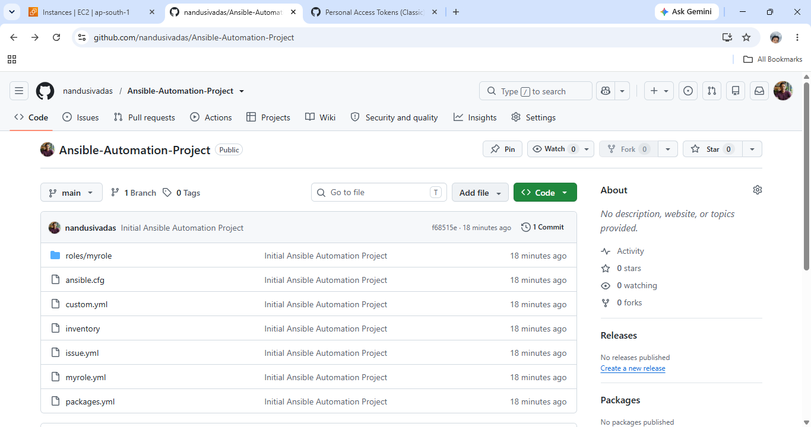


## 6️⃣ Final Web Server Output

> Apache Web Server successfully deployed

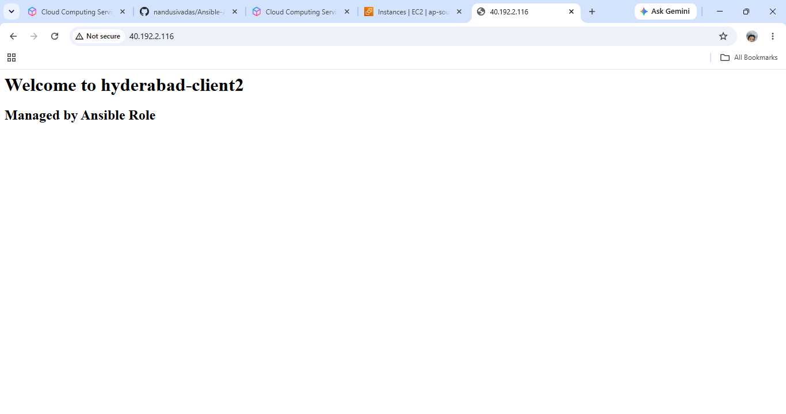


## 🚀 How to Run

### Clone Repository

```bash
git clone https://github.com/nandusivadas/AWS-Infrastructure-Automation-with-Ansible.git
```

### Navigate to Project

```bash
cd AWS-Infrastructure-Automation-with-Ansible
```

### Verify Inventory

```bash
cat inventory
```

### Execute Package Installation

```bash
ansible-navigator run packages.yml
```

### Execute Apache Role

```bash
ansible-navigator run myrole.yml
```

### Execute Issue Configuration

```bash
ansible-navigator run issue.yml
```

### Execute Custom Web Configuration

```bash
ansible-navigator run custom.yml
```


## ✅ Skills Demonstrated

- AWS EC2
- Amazon Linux Administration
- Infrastructure Automation
- Ansible
- Ansible Navigator
- Docker
- SSH Key Authentication
- Apache HTTP Server
- Jinja2 Templates
- Configuration Management
- Git & GitHub
- Linux System Administration


## 📖 Documentation

Detailed project documentation is available in the repository.

📄 **AWS-Infrastructure-Automation-with-Ansible**


## 📌 Project Outcome

Successfully automated Linux server configuration using Ansible, deployed Apache web servers through reusable playbooks and roles, and demonstrated Infrastructure as Code (IaC) by recreating the environment in another AWS region using the same automation project.


## 👨‍💻 Author

**Nandu Sivadas**

Cloud & DevOps Enthusiast

LinkedIn: *www.linkedin.com/in/nandu-sivadas-556264396*
